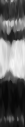

# Implicit Neural Representation for Accelerated Cardiac MRI Reconstruction

Please first install `PyTorch` following the [official website](https://pytorch.org/). Then please install other 
dependencies by:
```bash
git clone https://github.com/10258392511/ImplicitNeuralRepr.git
cd ImplicitNeuralRepr
pip3 install -e .
```
### Global: 2D + Time + Regularization
<table align="center" id="global-2d-time-reg">
    <tr>
        <th>&lambda;</th>
        <th>Mag<span style="color: white;">.</span></th>
        <th >Phase</th>
        <th>Mag<span style="color: white;">.</span> @ T / 2</th>
        <th>Phase @ T / 2</th>
        <th>Mag<span style="color: white;">.</span> @ H / 2</th>
    </tr>
    <tbody align="center">
        <tr>
            <td>Original</td>
            <td></td>
            <td></td>
            <td></td>
            <td></td>
            <td></td>
        </tr>
        <tr>
            <td>ZF</td>
            <td></td>
            <td></td>
            <td></td>
            <td></td>
            <td></td>
        </tr>
        <tr>
            <td>-5</td>
            <td></td>
            <td></td>
            <td></td>
            <td></td>
            <td></td>
        </tr>
        <tr>
            <td>-2.5</td>
            <td></td>
            <td></td>
            <td></td>
            <td></td>
            <td></td>
        </tr>
        <tr>
            <td>0</td>
            <td></td>
            <td></td>
            <td></td>
            <td></td>
            <td></td>
        </tr>
    </tbody>
</table>

<div align="center">
    <strong>Reconstruction with different &lambda;, taking &lambda; as coordinate.
Larger &lambda; results in smoother signals in temporal dimension.</strong>
</div>
