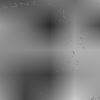
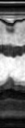

# Implicit Neural Representation for Accelerated Cardiac MRI Reconstruction

Please first install `PyTorch` following the [official website](https://pytorch.org/). Then please install other 
dependencies by:
```bash
git clone https://github.com/10258392511/ImplicitNeuralRepr.git
cd ImplicitNeuralRepr
pip3 install -e .
```
### Global: 2D + Time + Regularization
<table align="center" id="global-2d-time-reg">
    <tr>
        <th>&lambda;</th>
        <th>Mag<span style="color: white;">.</span></th>
        <th >Phase</th>
        <th>Mag<span style="color: white;">.</span> @ T / 2</th>
        <th>Phase @ T / 2</th>
        <th>Mag<span style="color: white;">.</span> @ H / 2</th>
    </tr>
    <tbody align="center">
        <tr>
            <td>Original</td>
            <td></td>
            <td></td>
            <td></td>
            <td></td>
            <td></td>
        </tr>
        <tr>
            <td>ZF</td>
            <td></td>
            <td></td>
            <td></td>
            <td></td>
            <td></td>
        </tr>
        <tr>
            <td>-5</td>
            <td></td>
            <td></td>
            <td></td>
            <td></td>
            <td></td>
        </tr>
        <tr>
            <td>-2.5</td>
            <td></td>
            <td></td>
            <td></td>
            <td></td>
            <td></td>
        </tr>
        <tr>
            <td>0</td>
            <td></td>
            <td></td>
            <td></td>
            <td></td>
            <td></td>
        </tr>
    </tbody>
</table>

<div align="center">
    <strong>Reconstruction with different &lambda;, taking &lambda; as coordinate.
Larger &lambda; results in smoother signals in temporal dimension. However, these reconstructions lose details and texture.</strong>
</div>

<br>

### LIIF: 2D vs 3D Convolutional Encoder
<table align="center" id="liif-2d-vs-3d-conv-enc">
    <thead>
        <tr>
            <th>Config</th>
            <th>Mag<span style="color: white;">.</span></th>
            <th>Mag<span style="color: white;">.</span> @ T / 2</th>
            <th>Mag<span style="color: white;">.</span> Error @ T / 2</th>
            <th>Mag<span style="color: white;">.</span> @ H / 2</th>
        </tr>
    </thead>
    <tbody align="center">
        <tr>
            <td>Original</td>
            <td></td>
            <td></td>
            <td></td>
            <td></td>
        </tr>
        <tr>
            <td>ZF</td>
            <td></td>
            <td></td>
            <td></td>
            <td></td>
        </tr>
        <tr>
            <td>2D, C = 8, Sine</td>
            <td></td>
            <td></td>
            <td></td>
            <td></td>
        </tr>
        <tr>
            <td>2D, C = 64, Sine</td>
            <td></td>
            <td></td>
            <td></td>
            <td></td>
        </tr>
        <tr>
            <td>3D, C = 16, Sine</td>
            <td></td>
            <td></td>
            <td></td>
            <td></td>
        </tr>
    </tbody>
</table>

<div align="center">
    <strong>3D convolutional encoder with sine activation LIIF is the best. Note that larger number of output channels for 2D convolution encoder results in static reconstruction.</strong>
</div>

### LIIF: Architecture Search
<table align="center" id="liif-architecture-search">
    <thead>
        <tr>
            <th>R</th>
            <th>Config</th>
            <th>Mag<span style="color: white;">.</span></th>
            <th>Mag<span style="color: white;">.</span> @ T / 2</th>
            <th>Mag<span style="color: white;">.</span> Error @ T / 2</th>
            <th>Mag<span style="color: white;">.</span> @ H / 2</th>
        </tr>
    </thead>
    <tbody align="center">
        <tr>
            <td>3</td>
            <td>Original</td>
            <td></td>
            <td></td>
            <td></td>
            <td></td>
        </tr>
        <tr>
            <td>3</td>
            <td>ZF</td>
            <td></td>
            <td></td>
            <td></td>
            <td></td>
        </tr>
        <tr>
            <td>3</td>
            <td>UNet Encoder</td>
            <td></td>
            <td></td>
            <td></td>
            <td></td>
        </tr>
        <tr>
            <td>3</td>
            <td>RDN Encoder</td>
            <td></td>
            <td></td>
            <td></td>
            <td></td>
        </tr>
        <tr>
            <td>3</td>
            <td>Temporal TV</td>
            <td></td>
            <td></td>
            <td></td>
            <td></td>
        </tr>
        <tr>
            <td>6</td>
            <td>Original</td>
            <td></td>
            <td></td>
            <td></td>
            <td></td>
        </tr>
        <tr>
            <td>6</td>
            <td>ZF</td>
            <td></td>
            <td></td>
            <td></td>
            <td></td>
        </tr>
        <tr>
            <td>6</td>
            <td>UNet Encoder</td>
            <td></td>
            <td></td>
            <td></td>
            <td></td>
        </tr>
        <tr>
            <td>6</td>
            <td>RDN Encoder</td>
            <td></td>
            <td></td>
            <td></td>
            <td></td>
        </tr>
        <tr>
            <td>6</td>
            <td>Temporal TV</td>
            <td></td>
            <td></td>
            <td></td>
            <td></td>
        </tr>
    </tbody>
</table>

<div align="center">
    <strong>RDN encoder performs better than both shallow UNet encoder and temporal TV by large margin under both acceleration rates.</strong>
</div>
